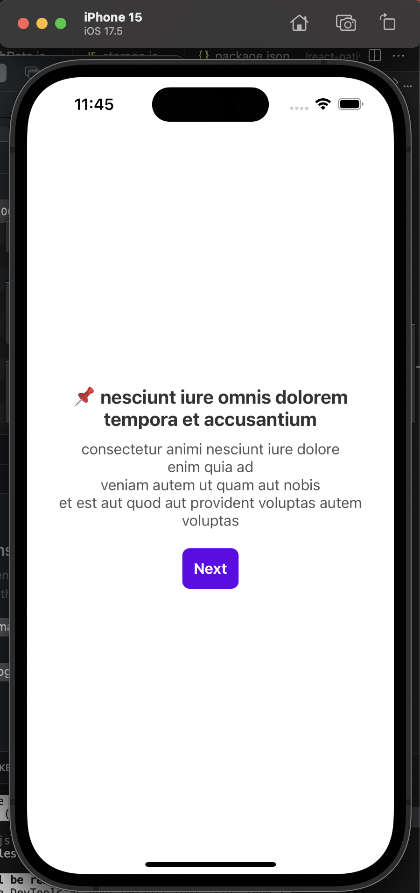
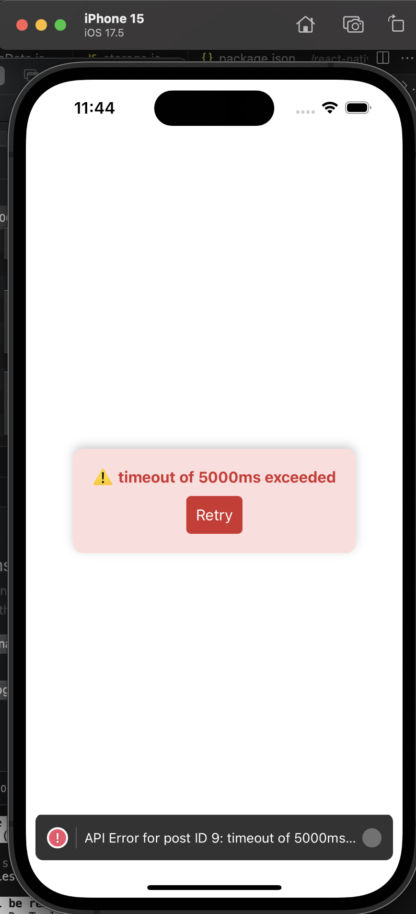

# React Native API Calls using Axios & Axios Retry

Developed a component that makes API calls using Axios:  

When the API request times out (due to network issues or no connection), it waits for five seconds and handles the error gracefully without crashing:  

## Reflections

Axios is preferred over `fetch` because it includes multiple built-in features such as automatic request/response transformation, timeout handling, request cancellation, and response interception. In contrast, `fetch` requires these functionalities to be manually implemented.

Axios-Retry improves network reliability by automatically retrying failed requests, especially in scenarios involving network errors.

Similar to how I developed the sample program, I will include a loader whenever an API call is made. In the event of a failure, Axios-Retry will be used to automatically retry the request. Additionally, an error handler will display a meaningful error message, and the UI will provide a fallback option to either retry the request or use offline cached data.
