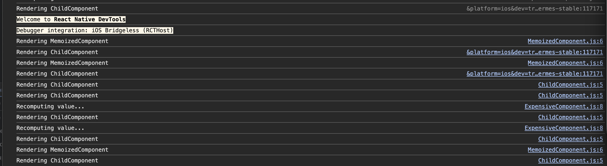
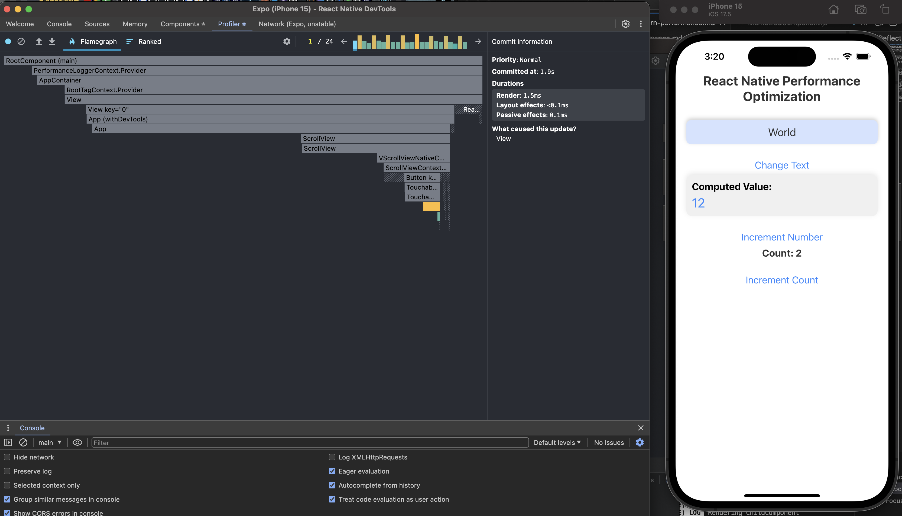
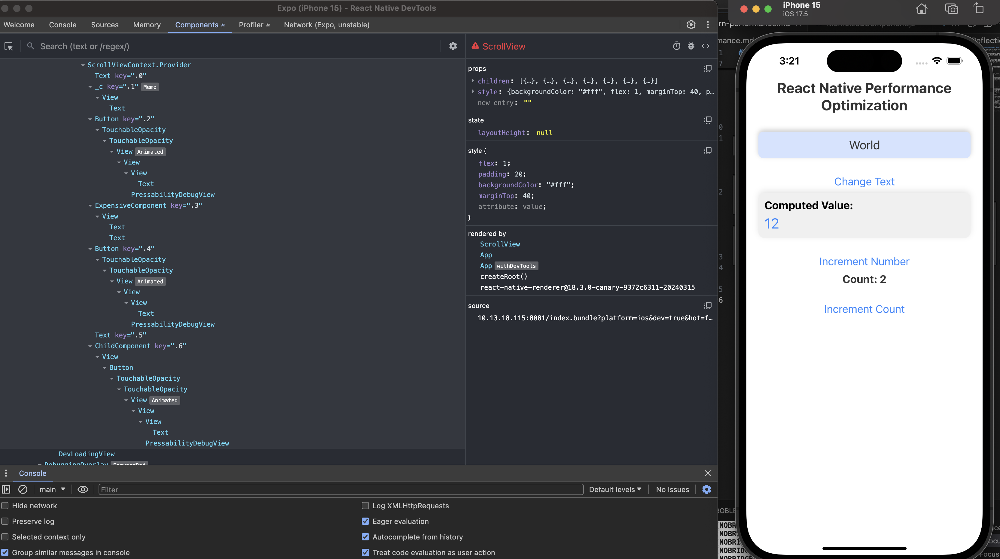
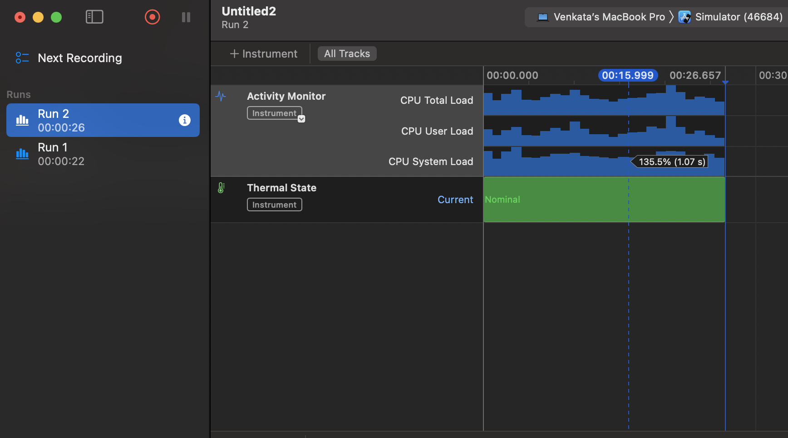

# Performance Optimization in React Native

Explored `useMemo`, `useCallback`, and `React.memo` in React Native using different components:

- The ExpensiveComponent uses `useMemo` to memoize expensive calculations and returns cached values when dependencies, in this case, the number, haven't changed.
- The ChildComponent utilizes `useCallback` to ensure that the `increment` function is not recalled in every render of the parent component. This is more useful in larger projects where the child component gets large.
- Used `React.memo` to prevent unnecessary re-renders in the MemoizedComponent by wrapping the content inside `React.memo`.

As can be seen here, the child component doesn't have any `useMemo` or any other memoization, so it re-renders for any change that happens, whereas the ExpensiveComponent re-renders only when the value changes and recomputation is required. The MemoizedComponent re-renders only when the text changes. Through this, the importance of memoization is known.

---

## Reflections

The most common performance bottlenecks are caused by unwanted re-renders of child components due to state/props changes. Memory leaks, caused by unreleased resources, build up over time and degrade performance. Another common issue is inefficient rendering of long lists. `FlatList` and its inbuilt features help improve this.

- `useMemo` is used to memoize expensive calculations or derived values. If a component needs to perform a complex calculation, `useMemo` ensures the calculation is only performed when the input values (dependencies) change, rather than on every render.
- If you pass a function as a prop to a child component, it will be redefined every time the parent re-renders unless it is memoized with `useCallback`. This helps avoid unnecessary re-renders of child components, especially in large and complex UIs.

React Native DevTools has multiple tools like Profiler, which is useful in identifying re-renders and their causes, and Components, which allows you to see the entire app in a tree format, including props and the render cause. Also, checked Xcode Instruments to check for memory leaks and activity monitor in the app.

  
  

