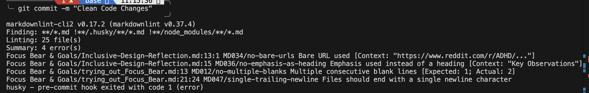
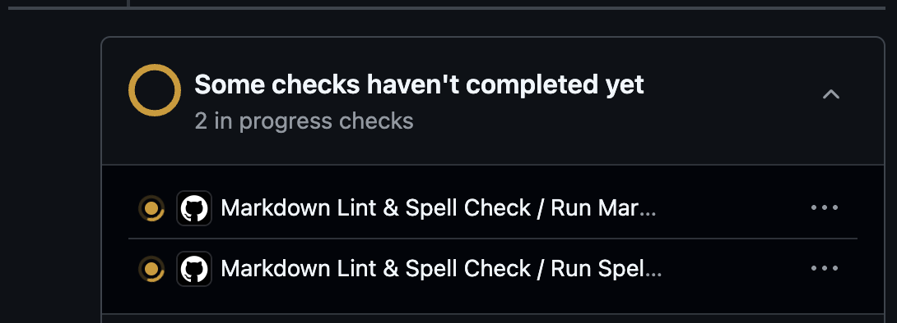
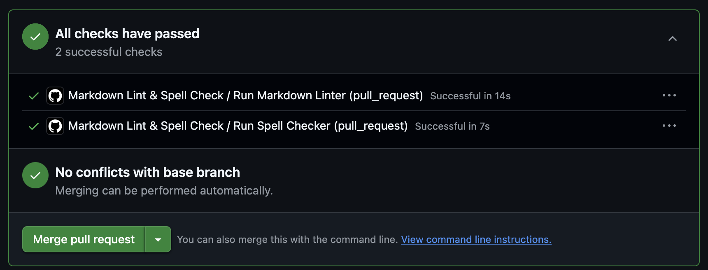

# Static Analysis Checks in CI/CD

Added Husky hooks to perform pre-commit checks:  

Added CI/CD lint checker in GitHub:  
  

## Reflections

Continuous Integration (CI) and Continuous Delivery/Deployment (CD) are processes that frequently test and deploy in an automated manner.

Automated style checks enforce consistency across the codebase and alert developers when they miss spelling checks, prompting them to correct it.

Some of the challenges with enforcing checks in CI/CD include:

- The impact on performance by taking up extra time, which slows down the overall process.

In smaller projects, simple pipelines with basic tests are enough, whereas in larger projects, due to the sheer size of the team and the complexity of the project, a multi-stage pipeline with extensive testing is required.  
In smaller teams, the rules tend to be more flexible, and approvals take less time as they are manual. However, in larger teams, the rules are more rigid with stricter compliance checks, and there are automated rollback mechanisms for any issues in the checks.
