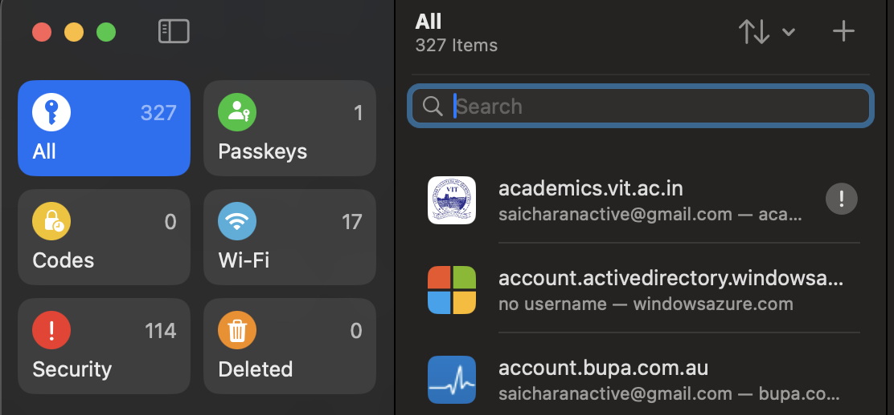

# Cyber Security Guidelines

## Reflections

Cybersecurity is essential when using any digital device, especially in a work environment. I currently follow basic security measures such as locking my device when stepping away, using strong passwords without writing them down, and utilizing a VPN when working on public networks.

Additionally, I will be more vigilant in scrutinizing emails to avoid phishing attacks. I am also considering using a password manager like 1Password or Apple Password Manager to securely store my credentials.

To enhance my cybersecurity practices, I will:

- Be extra cautious of suspicious emails and change my passwords periodically.
- Use password managers to generate and autofill strong passwords.
- Immediately report security incidents, similar to how Jeremy demonstrated when a pre-intern reached out to him. I will also change any related passwords if necessary.

A new cybersecurity habit I have adopted is using a password manager. I have imported all my Chrome passwords into Apple Password Manager and now use it across all my devices.

