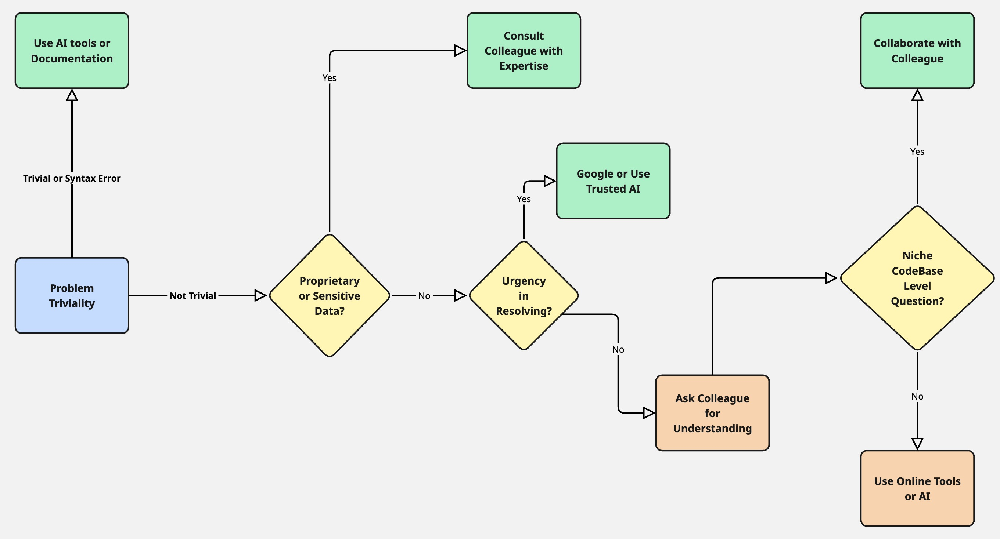

# Help Strategy

I would prefer AI over searching Google when I need to fix a very specific issue, like if I am facing an error in my code, environment setup, or while running the code. The error would give me the correct fix through AI, but I would have to spend a lot more time on Google.

When handling sensitive code or a very niche, low-level question, a colleague might have better context than AI or Google.

While troubleshooting alone, a developer wouldn't have the complete context or know what to expect. Even for a simple problem, they might overthink it for hours and get stuck. Hence, collaboration generally helps.

FlowChart:-

