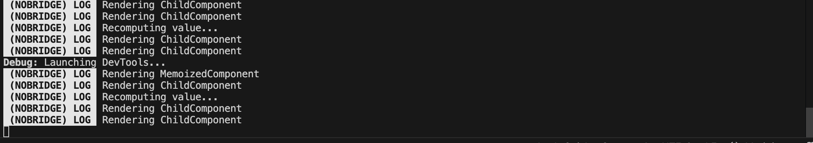
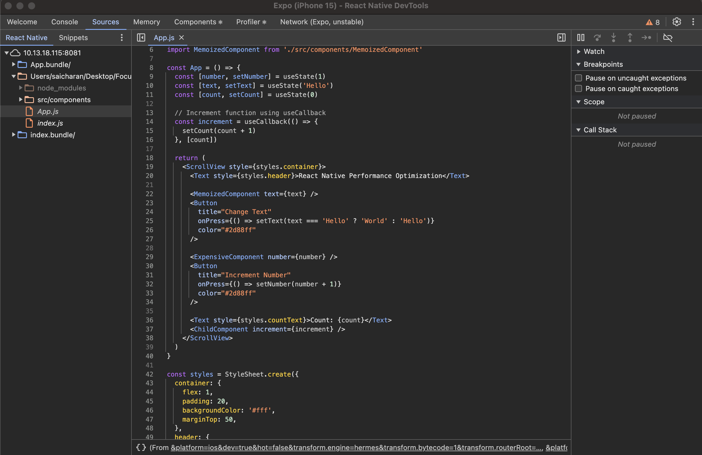
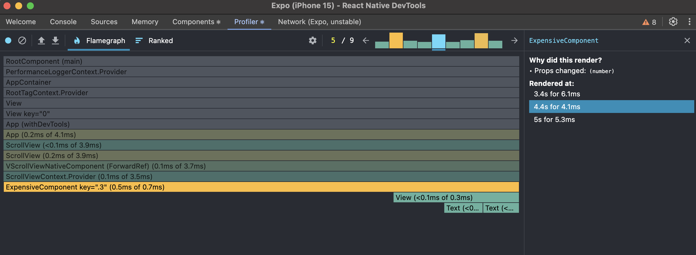
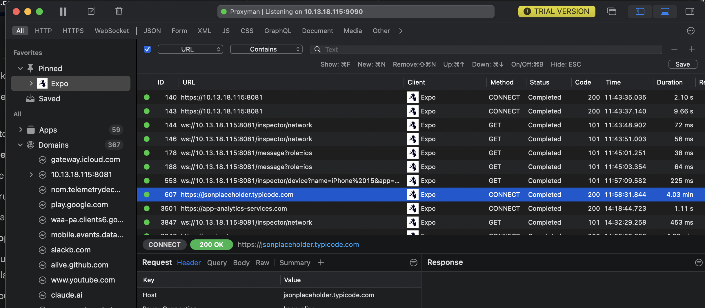

# Debugging React Native Apps

Metro helps with debugging through logs, as well as any form of errors and warnings. After fixing anything, hot reload is also possible through Metro.

I was facing issues running Flipper, so as an alternative, I used React Native Dev Tools and Proxy-man to inspect network requests in React Native.

