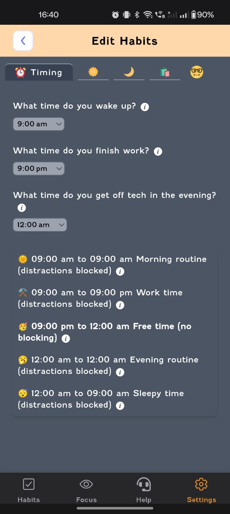
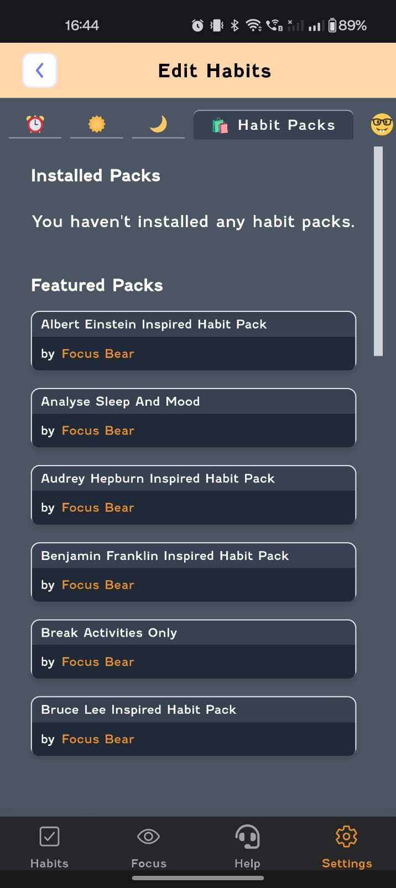
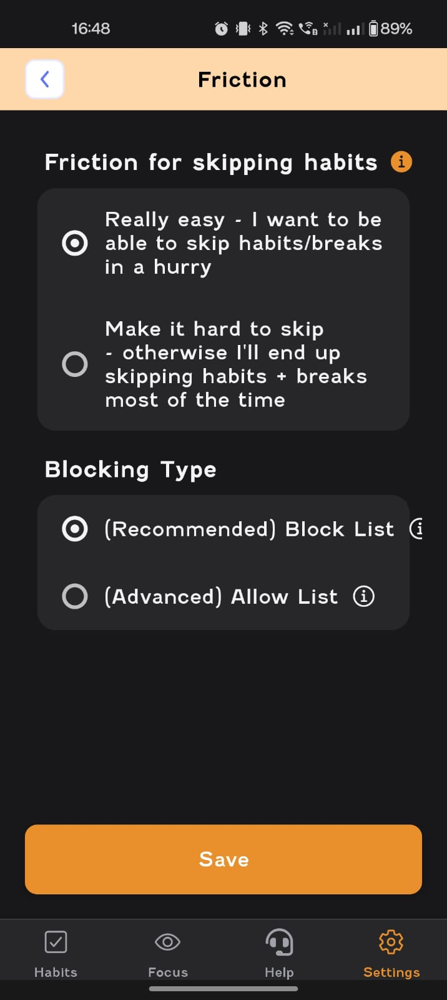

# Company Reflection

## Reflections

Focus Bear was initially created as a personal project by Jeremy but has evolved into an application designed to help neurodivergent individuals manage their time better and stick to their habits.

The app primarily supports neurodivergent individuals, including those with AuDHD, as well as anyone who struggles with distractions and executive functioning.

This mission is crucial because it helps neurodivergent individuals who often find traditional productivity tools ineffective. By providing a structured approach to time management and habit formation, Focus Bear enables users to organize their lives more effectively and enhance their overall well-being.

As someone who values accessibility and has close friends diagnosed with ADHD, I understand their struggles firsthand. Contributing to solutions that address these challenges aligns with my personal values. Additionally, since we are also developing a mobile app, Focus Bear's work aligns with my technical interests as well.

Recently, I met someone diagnosed with both ADHD and OCD. During an in-depth conversation, they shared that one of their biggest challenges was time management and completing tasks despite meticulous planning. When I mentioned Focus Bear to them, they were genuinely excited about the work the team is doing and even provided a few suggestions on how they could better utilize the application.

### User Testing Session Notes

#### Windows Application

##### App Selection

Users found selecting apps unclear and needed explanations.

##### Minimization Issues

App was not minimizing or running in the background.

##### Blocking Feature Issue

Likely a permission issue, as blocking did not work properly.

##### Error Encountered

Received an exception: AUTH0.CORE.EXCEPTIONS.ERROR_API_EXCEPTION resulted in blocking.

#### Android Application

##### User Personalization

The app should prompt for user profiles (e.g., Student, etc.) so that it can better recommend and also ask users their interests and activities to provide better recommendations.

##### Task Management Preferences

Users do not finish work in one go due to ADHD.  
No fixed working hours; work schedule varies daily, so this needs to be taken into consideration.  
More flexible options are required to accommodate these needs.

##### Blocking Permissions Setup

Wake-up time was considered in blocking, but more customization options were needed as it was taking wake-up time to sleep time as working time, but it was not accurate in real life.  

##### UI/UX Issues

ScrollView Position: Does not retain position after navigation.  
Extra Icon: A smiley icon appears at the end but is not clickable.  
  
UI Bugs:  
Friction Page: The "i" button overlaps with other elements.  

##### Positive Feedback

- Different colors for dialogue boxes enhance readability.
- Color-coded UI elements were appreciated.
- Habit Packs feature received positive feedback.
- Stats design (orange coloring) and overall statistics screen was well received.
- Blocking functionality works effectively.
