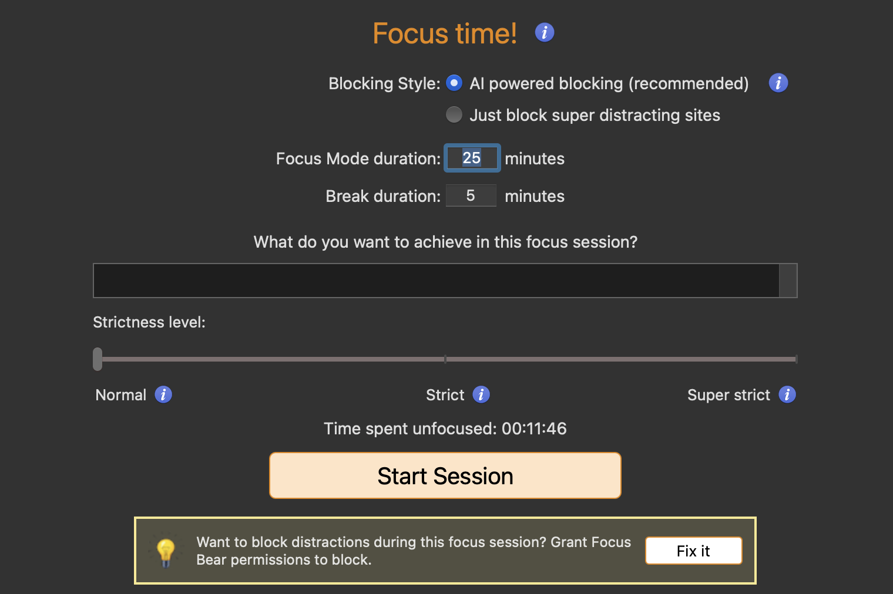
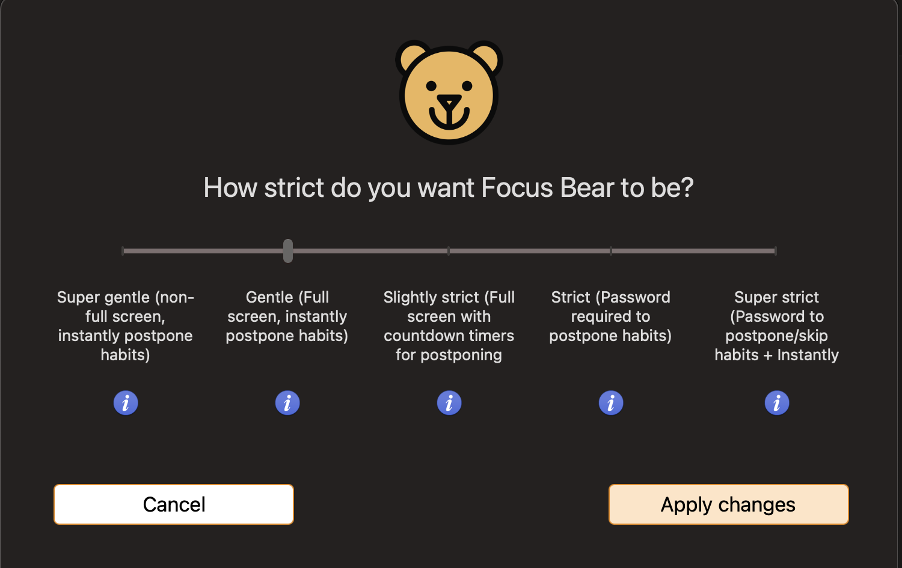

# Trying Out Focus Bear

## Reflections

The app doesn't feel polished enough. I tried it on my Mac first, and the UI could be further refined. There are too many questions initially, with less flexibility. For example, I might study in the morning and evening, but the app only allows one time window to be chosen.

The questions was in the onboarding so don't have screenshots but regarding below feedback of UI:-

Here the UI could be made simpler and minimalist

The UI is a bit overwhelming, with too many questions, which makes it difficult to understand at first.

However, it seems like a focus-improving application.

It would be better with a more polished UI and the option to skip questions, allowing users to complete the setup later.

Here, when we move the slider, we can add a small emoticon above the description or change the bear logo from the basic green (super gentle) to red as we move it to the right, with the logo changing to match the intensity.
Similarly here as well:-
