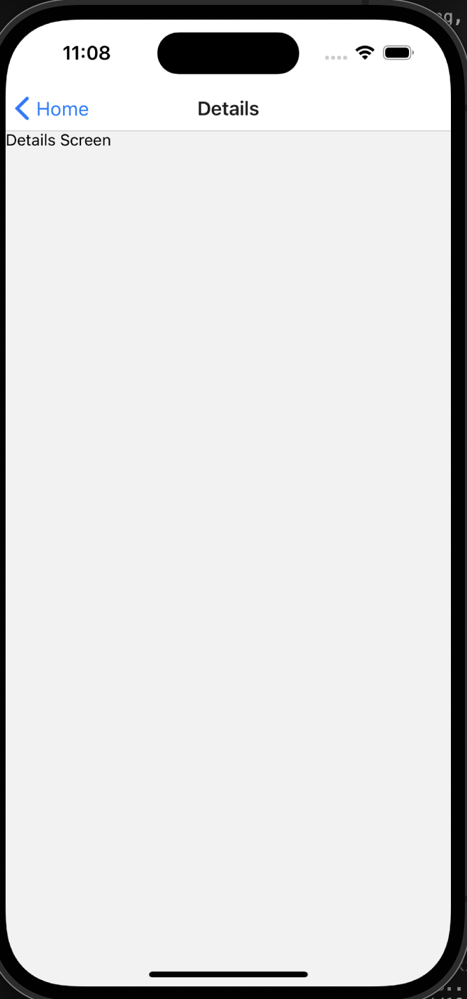

# Handling Deep Linking and Routing

Used Linking to create deep link and screens to verify how it works:-

Deep linking improves the user experience by letting users navigate directly to specific screens via external links, such as emails or notifications. It streamlines app access, aiding marketing, onboarding, and user retention.

React Navigation makes deep linking easy by mapping URLs to screens in the app. It listens for incoming links, extracts the path, and directs users to the appropriate screen, regardless of whether the app is open, in the background, or closed.

Challenges with deep linking include ensuring consistency across iOS and Android, as both platforms handle links differently. Additionally, deep links with parameters need careful parsing to work correctly. Managing authentication flows becomes tricky when users are deep-linked into restricted areas, requiring proper session handling. Lastly, it's important to avoid broken links by ensuring all routes are well-configured to prevent errors.
