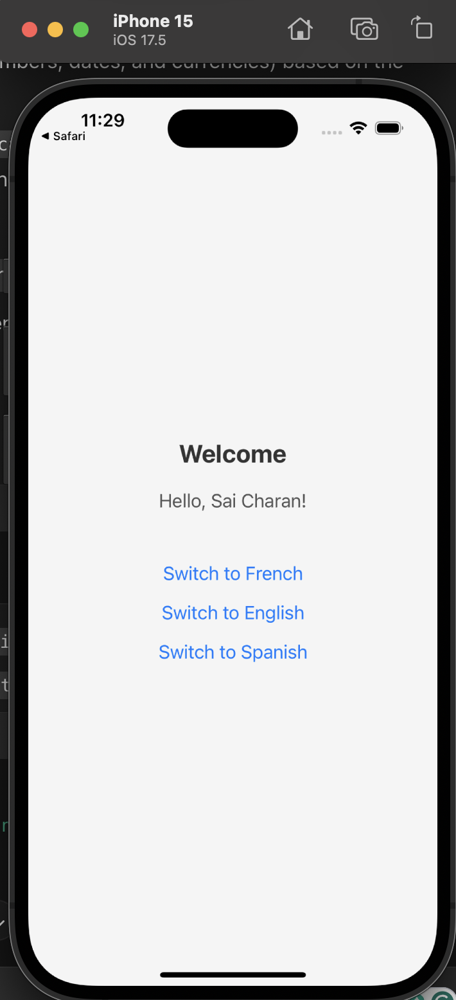
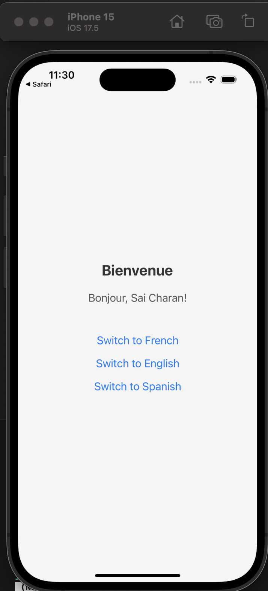
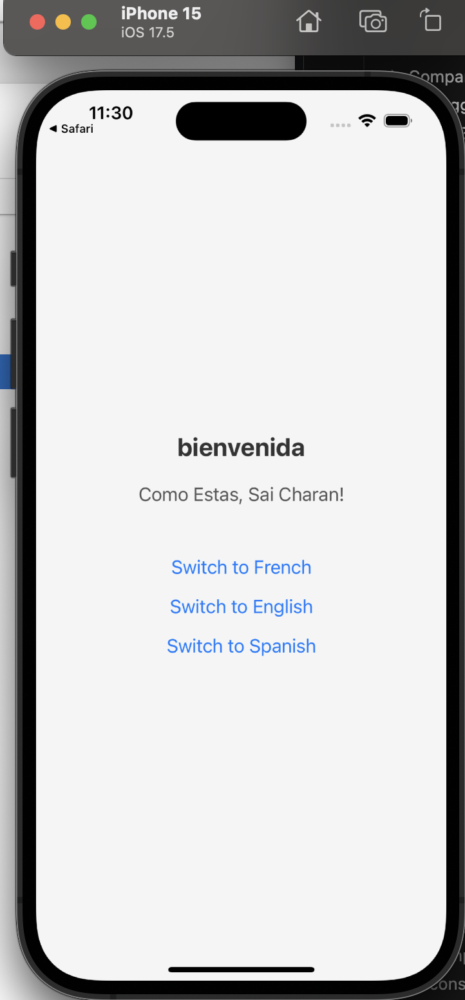

# Implementing Localization i18n

I tried out i18n and added three languages: English, French, and Spanish, with English as the default.

## Reflections

react-i18next handles translations by mapping keys (such as 'welcome' or 'hello') in JSON files to their respective translations. When the user interacts with the app, the correct translation is fetched based on the current language. It supports interpolation (inserting dynamic values) and fallback languages if a translation is missing.

Handling complex text and formats requires careful attention, especially with languages that have unique requirements, such as right-to-left (RTL) text or specific number and date formats. Additionally, supporting multiple languages can increase app size, and some languages may need special fonts or character sets for proper rendering and display. For instance, as the number of languages grows, we must keep in mind the increasing JSON file size, as more content and languages lead to larger JSON files.

Testing language switching ensures that all text is updated and the layout adapts correctly, especially for RTL languages like Arabic. Dynamic content, such as user names, should be tested to verify proper translation. Edge cases, like longer words, should be checked to prevent layout issues, and the app should detect the device locale for seamless language switching.
