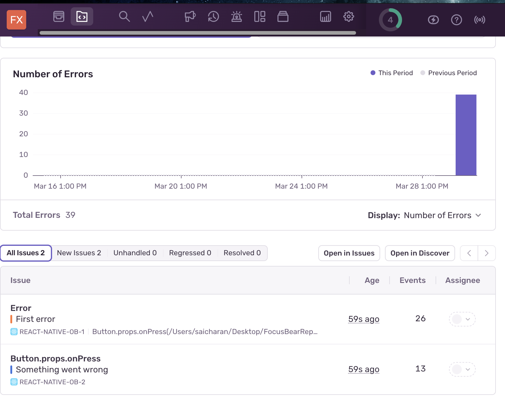
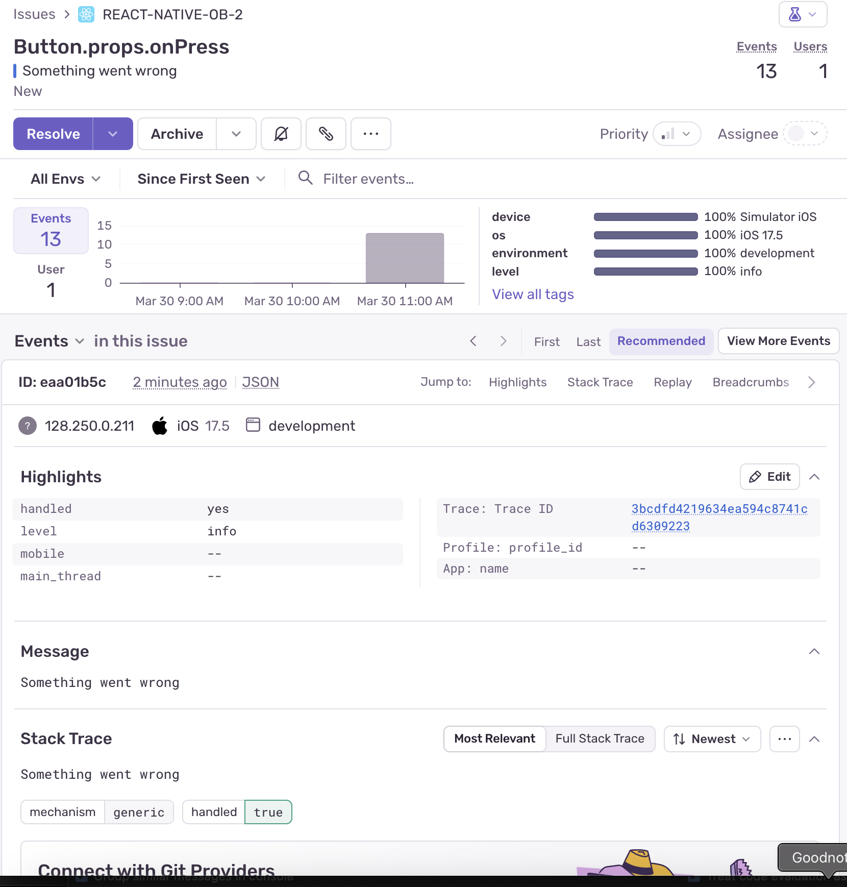

# Logging and Crash Reporting with Sentry

Successfully worked with Sentry, simulated an error, and verified it in Sentry logs:

  

## Reflections

### Types of Logs in Sentry

Errors: Critical issues that crash the app.
Warnings: Potential issues that don’t immediately break the app.
Debug Logs: Useful for tracking app behavior.
Performance Metrics: Helps identify slow screens and API calls.

### Importance of Logging

Logging helps identify and diagnose issues before they affect users. It allows developers to track crashes, monitor performance, and quickly resolve problems.

### Usage of Sentry in Debugging and Issue Tracking

Sentry provides real-time error tracking, automatic crash reporting, and performance monitoring. It captures stack traces, breadcrumbs, and user session data, making debugging more efficient.

### Best Practices for Handling and Logging Errors

To ensure effective logging in a production React Native app, it's important to categorize logs by using different levels for errors, warnings, and debug logs. Implementing breadcrumbs helps capture user interactions leading up to an error, providing better context for debugging. Additionally, sensitive data should never be logged; instead, obfuscating personally identifiable information (PII) ensures user privacy. Handling errors gracefully using try/catch blocks and error boundaries prevents crashes and improves user experience. Finally, monitoring performance by tracking slow API calls and UI responsiveness helps optimize app performance and stability.
