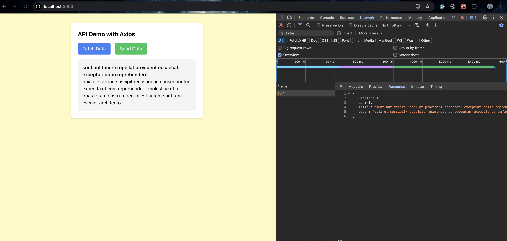
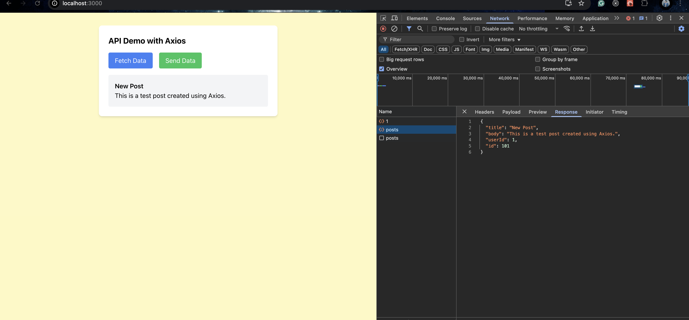

# Making API Calls with Axios

Fetch Data Implementation:-

POST Data Implementation:-

## axios Reflections

If we use a reusable axios instance, then the API configs are set up once and as they would remain the same, it avoids code redundancy and also allows central management of headers, base URLs and timeouts, which generally remain the same for multiple API endpoints.

Interceptors help in handling authentication and errors globally. This is done by getting the authentication token from local storage and attaching it to headers. Added the interceptor and handled errors in api.js

If a request exceeds the specified timeout, Axios throws an `ECONNABORTED` error. The response interceptor can catch this and prompt the user to retry.
