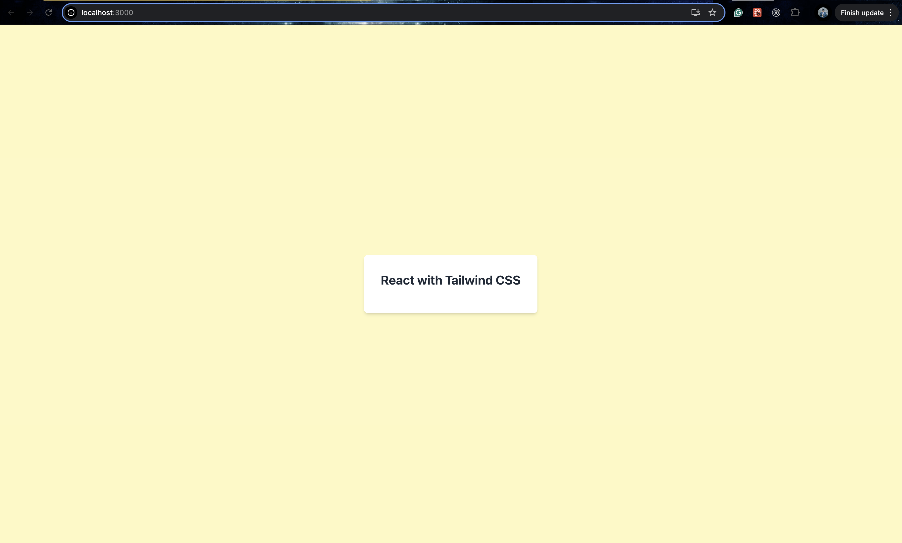

# React Fundamentals

Successfully ran the react project with tailwind css:-

Challenges Faced:-

The major challenge I faced was when I was trying to install Tailwind and set up the environment, the CSS changes were not visible. Even after receiving help from AI, the issue remained unresolved. The problem was eventually fixed when I realized that the `tailwind.config.js` file was not placed in the root of the project directory.
