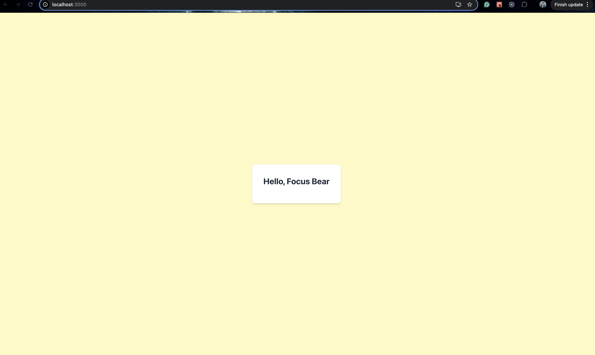
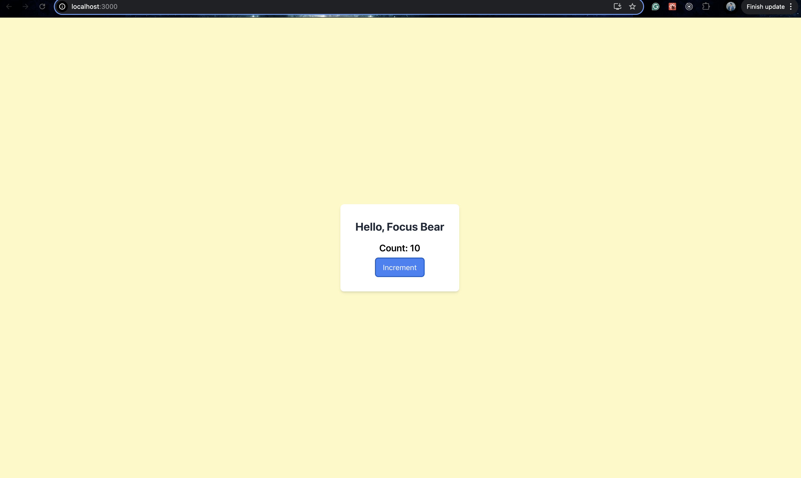
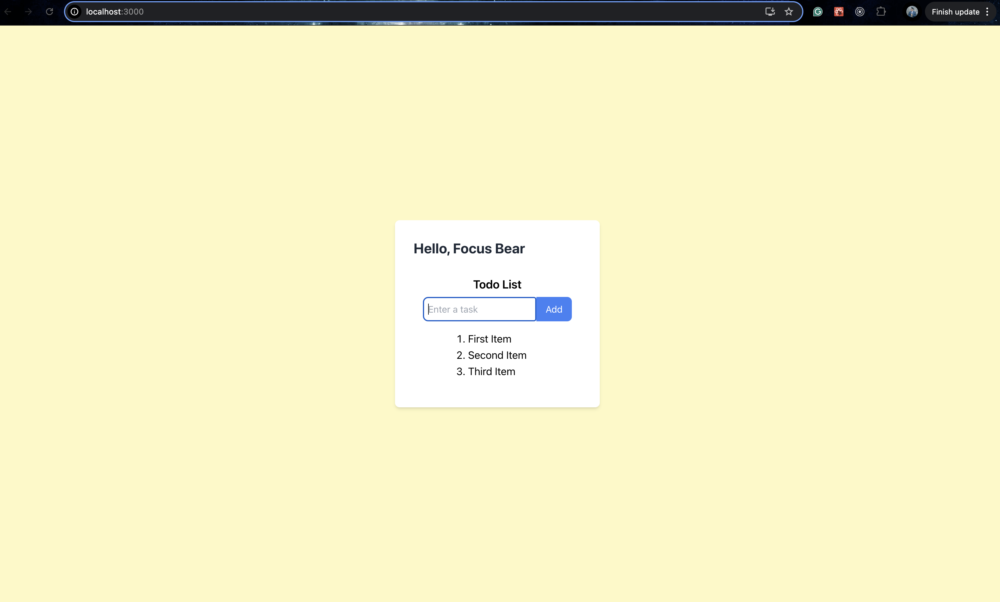
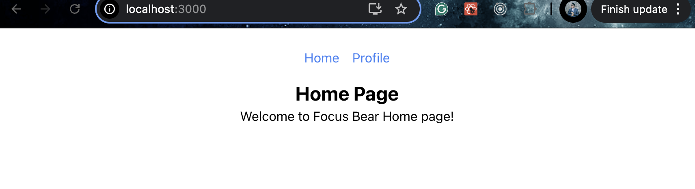
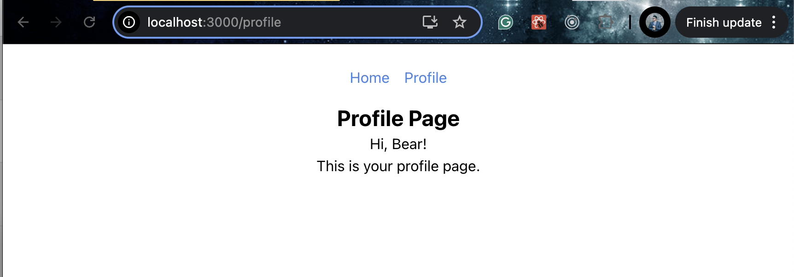

# React Fundamentals

Successfully ran the react project with tailwind css:-

Challenges Faced:-

The major challenge I faced was when I was trying to install Tailwind and set up the environment, the CSS changes were not visible. Even after receiving help from AI, the issue remained unresolved. The problem was eventually fixed when I realized that the `tailwind.config.js` file was not placed in the root of the project directory.

## Understanding Components & Props

Made a new component in the components folder called HelloWorld.js
Used App. to dynamically pass Focus Bear to this child component, destructured the props and displayed it:-

## Handling State & User Input

Developed `Counter.js`, a component that displays the count value and includes a button that changes color when hovered (to make it visually distinct as a button). When clicked, the button increments the count by setting its value to the previous count plus one.

I tried modifying the count directly by using `count++`, but this resulted in a warning stating that `count` is a constant and cannot be reassigned. More importantly, directly modifying the state does not trigger a re-render. This is why we use `setState`—to ensure that the value updates properly and the component re-renders wherever the state is used.

## Working with Lists & User Input

Created a component called `ListCreator.js` with a text input field and an adjacent "Add" button. When the user enters text and clicks the button, it adds the text to the list below. Added `onKeyDown` so that the user can enter text and press "Enter" to add it to the list.

### Reflections

Some common issues when working with lists in React include:

Properly displaying them without causing bugs.
Performance issues, especially when list items are complex components rather than just text.
To optimize performance in such cases, I have previously used `bucketing` and `FlatLists`, which have built-in parameters to handle large lists efficiently.

## Navigating with React Router

I created two components: `Home.js` and `Profile.js`, along with a `Navigator.js` component. The `Navigator.js` component displays links to the Home and Profile pages, which, when clicked, route to `/` and `/profile`, respectively. In the routes, `/` is associated with the Home component, and `/profile` is associated with the Profile component so that the router knows which component to connect to.

`Home Page:`

`Profile Page:`

`Reflections:`

The advantages of using client-side routing are that it leads to faster navigation since the full page doesn't reload, and the transition between pages is smoother. It also helps maintain the global state without losing data, as rendering is done on the client side. In contrast, server-side rendering requires more requests to the server, making client-side rendering better for performance as well.
