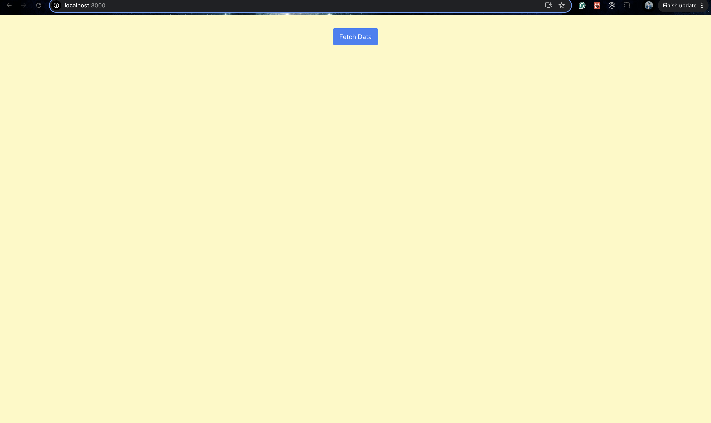
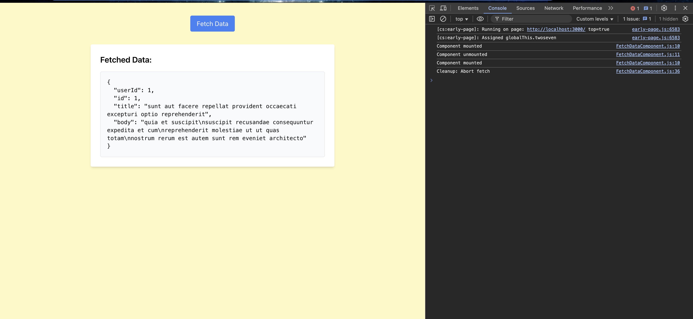

# React Hooks

## Understanding React Hooks

### Implemented FetchDataComponent

On clicking the button, it fetches data from the JSONPlaceholder API.

Before Fetch:  

After Fetch:  

### Reflections

`useEffect` is useful when we want to run actions automatically when a value changes or when a component mounts and unmounts. In contrast, event handlers are used for explicit, one-time user interactions.

In `useEffect`, the dependency array (`[]`) is used to specify values that, when changed, trigger the effect. If no dependency array is provided, `useEffect` runs only once when the component mounts.

Improper use of `useEffect` can cause performance issues, such as memory leaks if a cleanup function is not provided. Additionally, adding incorrect variables to the dependency array can lead to unnecessary re-renders of the component.
