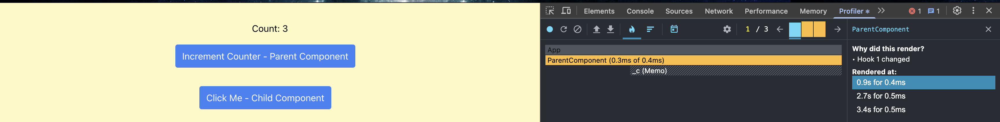

# React Hooks

## Understanding React Hooks

### Implemented FetchDataComponent

When the button is clicked, it fetches data from the JSONPlaceholder API.

Before Fetch:-

After Fetch:-

### useEffect Reflections

`useEffect` is useful when we need to run actions automatically when a value changes or when a component mounts and unmounts. In contrast, event handlers are used for explicit, one-time user interactions.

In `useEffect`, the dependency array (`[]`) specifies values that, when changed, trigger the effect. If no dependency array is provided, `useEffect` runs only once when the component mounts.

Improper use of `useEffect` can cause performance issues, such as memory leaks if a cleanup function is not provided. Additionally, adding incorrect variables to the dependency array can lead to unnecessary re-renders of the component.

## Optimizing Performance with useMemo

A component was created with two buttons: Increment Counter and Add Number. The Increment Counter button increases the count and re-renders the component, but it does not re-render the list of numbers since that operation is wrapped inside `useMemo`. The expensive calculation function is triggered only when the Add Number button is clicked.

With useMemo:-

Without useMemo:-

The same code was tested without `useMemo`, resulting in different behavior. As seen below, pressing the Increment Counter button unexpectedly triggers the Add Number function and calls the expensive calculation function unnecessarily.

### useMemo Reflections

As observed above, `useMemo` significantly reduces unnecessary computations by memoizing the result and preventing recalculations until its dependencies change.

However, `useMemo` should be avoided for small calculations as it introduces complexity and adds unnecessary memory overhead.

When `useMemo` was removed, the function re-ran on every re-render, even though its dependencies had not changed. This led to performance degradation.

## Preventing Unnecessary Renders with useCallback

In the `UseCallbackExample` component, two components were created: `ParentComponent` and `ChildComponent`. The `handleClick` function was wrapped with `useCallback` and passed as a prop to the child component. This ensures that the function's reference remains the same across renders unless its dependencies change.

Since `handleClick` has an empty dependency array (`[]`), it does not depend on `count`. As a result, when the parent component re-renders due to `incrementCounter`, the child does not re-render because it is wrapped inside `React.memo` and only re-renders when its props change.

Only the parent component re-renders, while the child component remains unchanged:  
  

When `useCallback` is removed, the child component re-renders every time the parent component re-renders:  
  

### useCallback Reflections

`useCallback` prevents unnecessary re-renders by ensuring a function reference remains the same unless its dependencies change. This is useful when passing functions to child components that should only re-render when necessary.

`useCallback` memoizes a function to prevent unnecessary re-creation, whereas `useMemo` memoizes a computed value to avoid recalculations.

If a function is not passed as a prop or does not cause performance issues, using `useCallback` is unnecessary and adds complexity.
