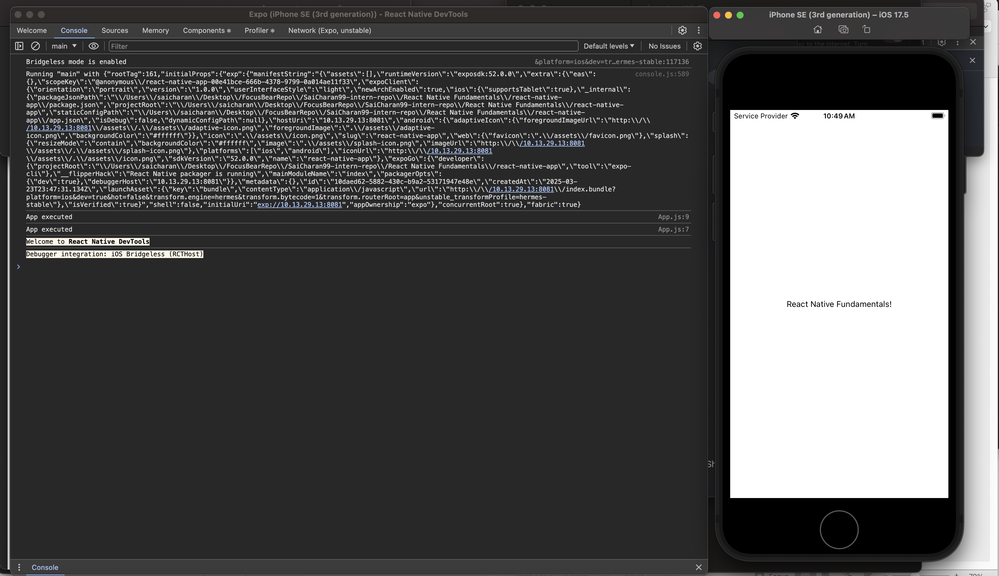
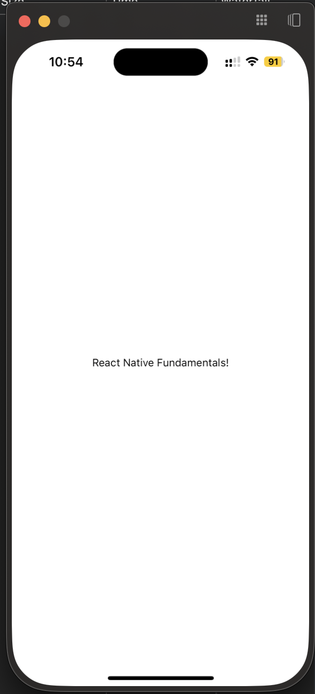

# React Native Environment Setup

Created a sample React Native project using Expo and started the debugger (activated by pressing 'J' on the Metro bundler).  
Hot reloading was working with the inbuilt simulator (iPhone SE) and also on my personal device using the Expo Client App.

  


## Reflections

Metro is the JavaScript bundler that compiles React Native code for mobile devices. It optimizes performance by bundling files efficiently and enabling fast refresh.

Expo simplifies the native setup by providing a pre-configured development environment, built-in APIs, and a cloud-based build system. It also ensures seamless compatibility across platforms.

The only issue I faced was when I installed expo-cli, it was a deprecated version, causing errors when running `npm start`. To resolve this, I uninstalled it using:

```bash
npm uninstall -g expo-cli
```

Then, I used:

```bash
npx expo start
```

which successfully started the project using the Metro bundler.
