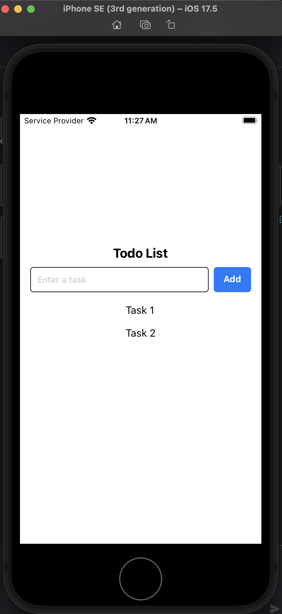

# React Native Components

Converted the to do list component in the react project to a react native component. The divs were converted to view, the button to a touchable opacity to replicate the button. `FlatList` was used to display the todo list items added Inline styling and Stylesheet.create(), both were used to style the elements.

## Reflections

`
` is an HTML element used in web development, while `<View>` is a React Native component that maps to native UI elements like UIView on iOS and android.view.View on Android. Styling for `
` relies on CSS, whereas `<View>` uses StyleSheet.create() or inline styles in JavaScript.

StyleSheet.create() creates a static style object that doesn't change between renders, reducing unnecessary re-renders and memory usage.

Inline styles are JavaScript objects that get recreated every render, causing performance overhead, hence they are not preferred.React Native optimizes styles created with StyleSheet.create() by referencing them with IDs instead of passing full style objects, making rendering more efficient.

React web uses className because styles are applied via CSS in the DOM. React Native does not have a DOM and instead styles components directly using JavaScript objects.React Native styles map directly to native UI properties, making StyleSheet.create() a better approach than a CSS-like system.
