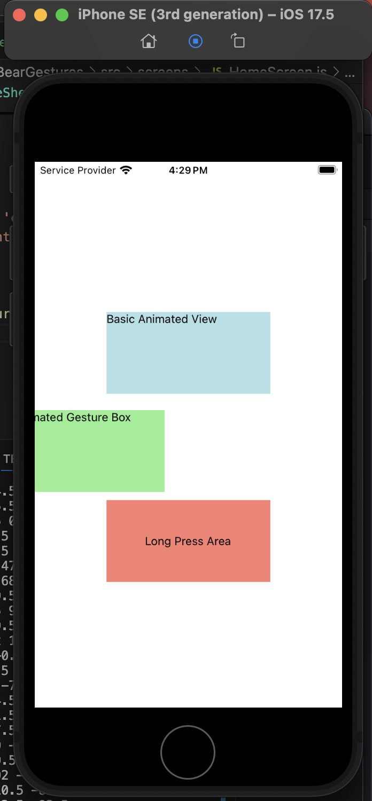

# React Native Gestures & Animations Reflections

I created a component with basic gestures using `InteractionManager` and utilized `InteractionManager.runAfterInteractions` to schedule long-running tasks after the interaction was completed.  

Additionally, I implemented another component with simple animations:  

## Reflections

Animated (Built-in API) vs. Reanimated
The built-in Animated API handles animations by running them on the JavaScript thread. This can sometimes cause performance hiccups, especially when you have a lot going on with your animations. It uses a command-based way of doing things, which can make it a bit tricky to combine different animations, and you have to manually set it up to run animations on the UI thread if you need that extra smoothness.

On the other hand, react-native-reanimated is designed to run animations directly on the UI thread by default. This makes animations much smoother. It gives you a more descriptive way to define your animations using things like useAnimatedStyle and useSharedValue. It's also better at letting you put animations together, and it supports `worklets` which are basically JavaScript functions that can run directly on the UI thread. Plus, it comes with some really powerful tools for controlling how animations look and behave.

react-native-gesture-handler
The react-native-gesture-handler library is all about making interactions feel super responsive. It does this by handling gestures directly on the UI thread, instead of sending them over to the JavaScript thread first. This cuts down on the delay between when someone touches the screen and when they see something happen. It also uses the built-in gesture recognition of the platform, which makes things feel natural. And it lets you combine different gestures in cool ways, like using panning, pinching, and rotating all at the same time. It gives you more precise control over how gestures work, helps prevent things from looking choppy when someone is making quick gestures, and works really well with Reanimated for creating animations that are driven by gestures.

When to Use Gestures vs. Buttons
Gestures feel really natural for things that mimic how we interact with the real world, like dragging something to move it or pinching to zoom. They're especially handy when you don't have a lot of space on the screen. They're great for things like swiping to delete items in a list, reordering items, or moving smoothly between screens or cards. They can also make for really immersive and interactive experiences. However, you do need to think about accessibility, as gestures might be easier for some people but harder for others. Generally, gestures are best for actions where someone is exploring or manipulating something, while buttons are better for important actions that need to be clear and obvious.

InteractionManager.runAfterInteractions
InteractionManager.runAfterInteractions is a helpful tool for making your app feel more responsive. It basically tells the app to hold off on doing less important work until after any animations have finished. This stops animations from getting bogged down and looking jerky, because the JavaScript thread isn't trying to do too much at once. It makes transitions feel smoother and also helps the system focus its resources on what the user is actually seeing. This is particularly useful when you have things that need to happen right after an animation finishes, and it helps make sure you don't get dropped frames during complex transitions, leading to a much better user experience, especially when moving between different parts of the app.
