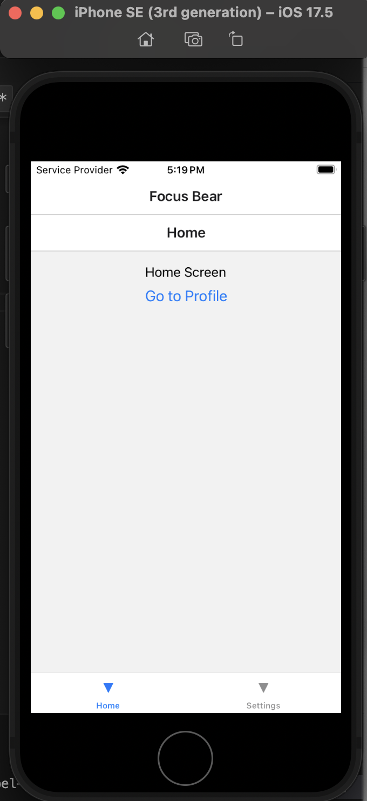
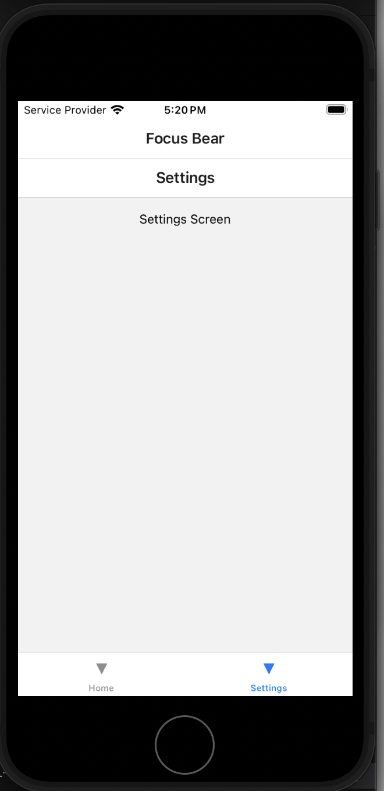
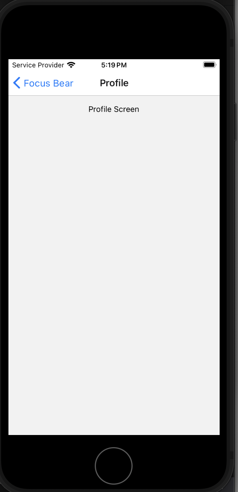

# React Native Navigation

Created a simple navigation with two tabs: Home & Settings:  
  

Added Profile screen to the home stack:  

## Reflection

Stack Navigation (createStackNavigator) organizes screens in a stack, like a history of pages. New screens are pushed onto the stack, and when navigating back, screens are removed. It's ideal for linear flows, like moving from login to dashboard to details.

Tab Navigation (createBottomTabNavigator) displays tabs at the bottom for easy switching between sections, maintaining each tab's state. It works well for primary sections like Home, Settings, or Profile.

Drawer Navigation (createDrawerNavigator) uses a side menu, often accessed with a hamburger icon. It's great for less frequently used sections in apps with multiple areas.

### Screen Transitions in React Navigation

React Navigation handles screen transitions with platform-specific animations. Stack Navigation uses a push/pop animation—sliding from the right on iOS and fading on Android. Tab Navigation switches screens instantly without animations by default. Drawer Navigation uses a sliding effect when opening or closing the drawer for smooth transitions.

Deep linking in React Native enables navigation to specific screens using custom URLs. The setup involves configuring your navigation container, setting up iOS and Android platform configurations, and handling incoming links with the Linking API. Similar to how I've configured navigation with prefixes, deep linking can be implemented to link between screens. I’ve seen this effectively implemented in my previous organization, where multiple screens benefited from deep linking, providing a seamless way to navigate between them.
