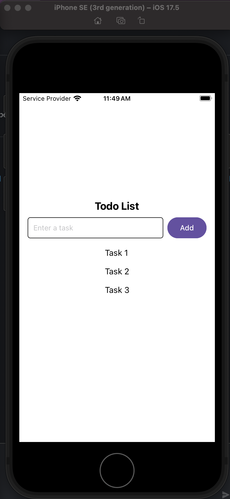
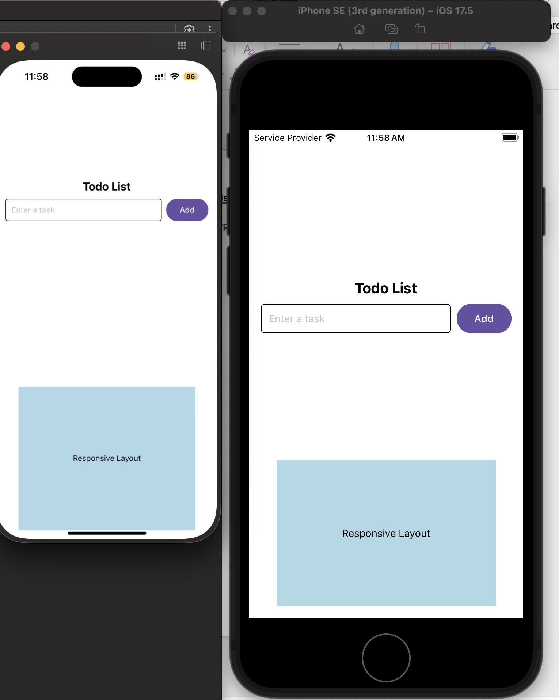

# React Native Styling

I installed react-native-paper and modified the previously created `ListCreator` React Native component to utilize it. Earlier, I was using `TouchableOpacity` to create a button, but now I'm using the built-in Button component from react-native-paper.

I used Dimensions, a built-in React Native feature, to get the dimensions of the device being used and scale the text box dimensions accordingly. I logged the dimensions for both the simulator and real device to aid in debugging:

These dimensions were then used to create a responsive View:

## Reflections

React Native uses camelCase for styling properties because styles are written in JavaScript instead of a separate CSS file. Since JavaScript object keys cannot contain hyphens (-), properties like `background-color` are written as `backgroundColor` to maintain consistency with JavaScript conventions.

Using `StyleSheet.create()` improves performance by optimizing style objects. This ensures that styles are created once and referenced efficiently, rather than generating new objects on each render. It also makes styles more reusable and organized, enhancing maintainability.

Using the Dimensions property in React Native allows us to retrieve the dimensions of the user's device and make the UI responsive to various screen sizes.
