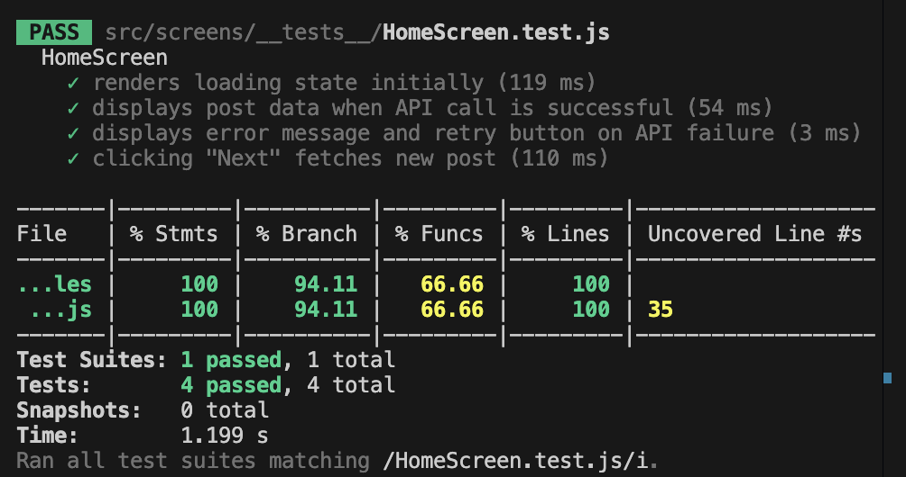
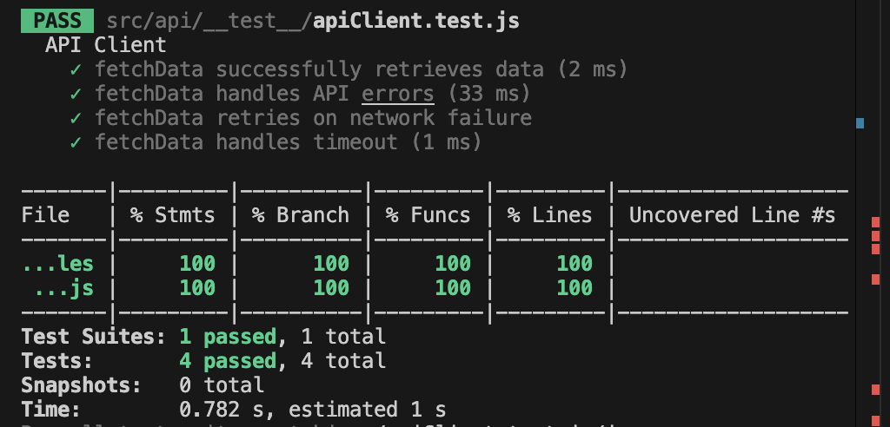
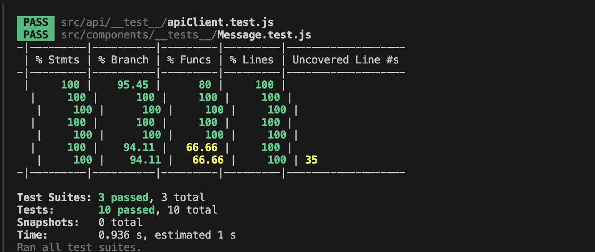

# RN Unit Testing

Already set up Jest testing and wrote unit tests for API calls and a UI component, then pushed them:

`apiClient.test.js`
`AxiosHomeScreen.test.js`

## Reflections

Automated testing ensures that code works correctly and continues to function as expected when changes are made. It helps catch bugs early, improves code reliability, and speeds up the development process by eliminating the need for repetitive manual testing. Automated tests also serve as documentation, making it easier for developers to understand how functions are expected to behave.

When writing test cases, the initial setup and package installation were the first hurdles. After configuring Jest, including setting up `jest.config.js`, the next challenge was mocking the data correctly and ensuring the expected results. Through trial and error, adjusting expectations, and verifying the output, I was able to fix the test cases and gain a deeper understanding of how to write them effectively.

Jest & React Native Testing Library:-

Pushed files Message.test.js

React Native Testing Library encourages testing components the way users interact with them rather than relying on internal implementation details.
