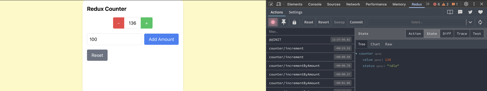
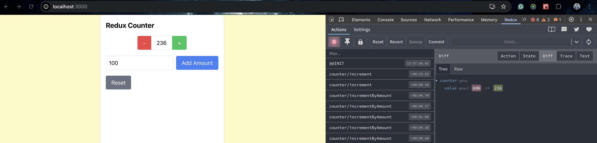
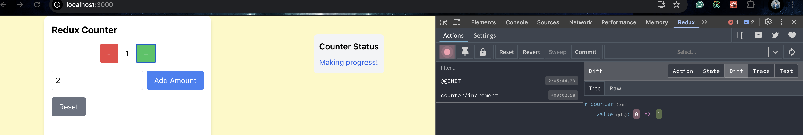
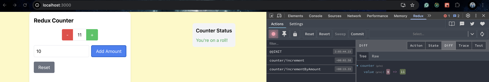
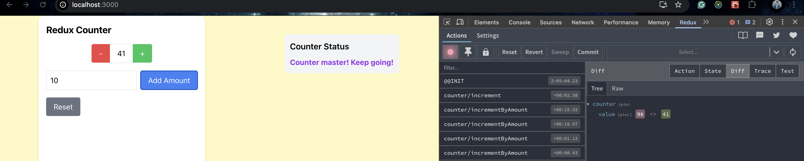

# Redux Toolkit

Set up a Redux store with `counterSlice` containing multiple actions to increment and decrement the counter. Also, add a selector to retrieve the stored value from the Redux store.

Redux state:  
  

## Redux Reflections

Although both `useState` and Redux can be used for state management, Redux is preferred for global state storage, as it allows multiple components to access and update the state. In contrast, `useState` is more suited for managing component-specific state.

Redux helps avoid prop drilling, where a prop is passed through multiple child components, leading to unnecessary re-renders. However, `useState` is preferable when state management is only required within a single component.

## Using Selectors in Redux Toolkit

Added another component called CounterMessage , which uses a useSelector tog et the current counter value and give a few messages based on a range to display a message. As we used redux, the value of counter can be utilized over multiple components using useSelector.

## useSelector Reflections

Using selectors instead of directly accessing Redux state improves maintainability and performance. Selectors also prevent unnecessary re-renders by ensuring components update only when the selected state changes. They also keep components clean by handling derived computations outside the UI. Since selectors are pure functions, they are easier to test without setting up a Redux store, making state management more efficient and scalable.
