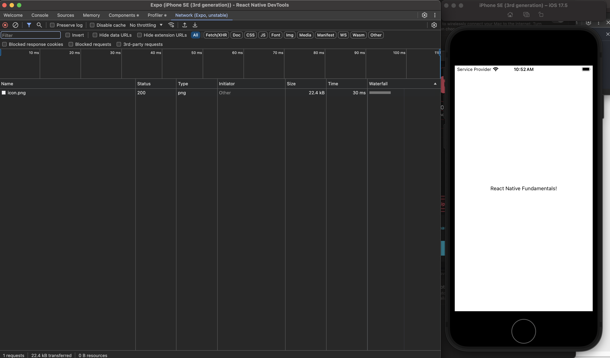

# Chrome Extensions

I installed React Developer Tools, Redux DevTools, JSON Formatter, and Lighthouse.

The most useful part was learning how to use the Lighthouse extension for performance auditing.

React Native DevTools for react native applications:-

