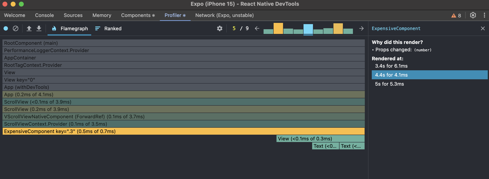
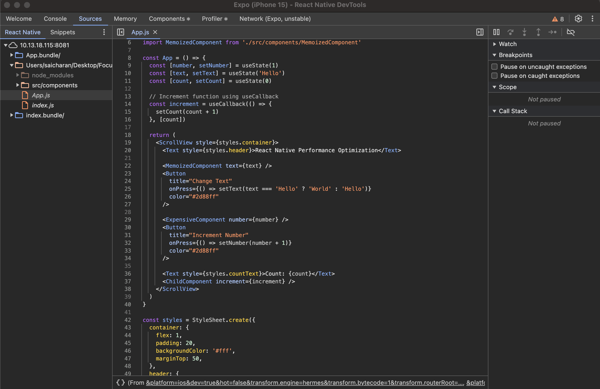
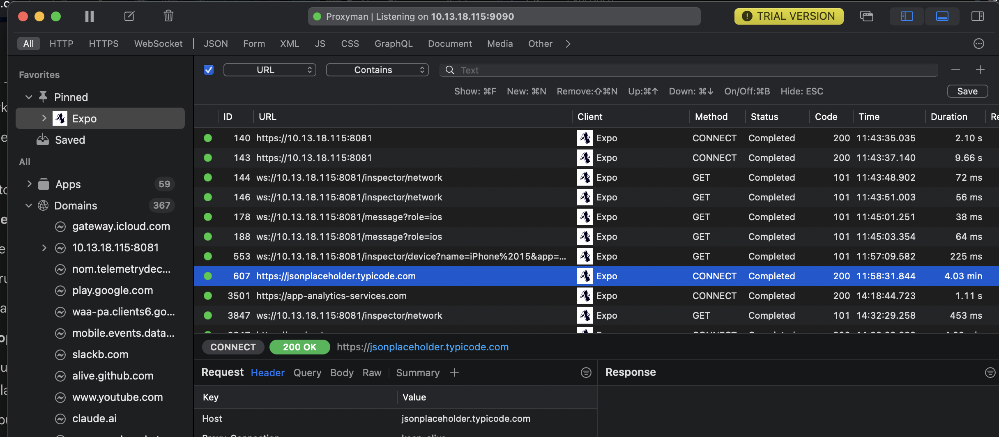

# Chrome Extensions

I installed React Native DevTools and tried its profiler. I also downloaded Proxyman for network interception and Instruments for memory leak checks. The most useful one is React Native DevTools, which not only helps with debugging using logs and component structure, but the profiler is also useful for identifying when a component re-renders and the cause of it.

