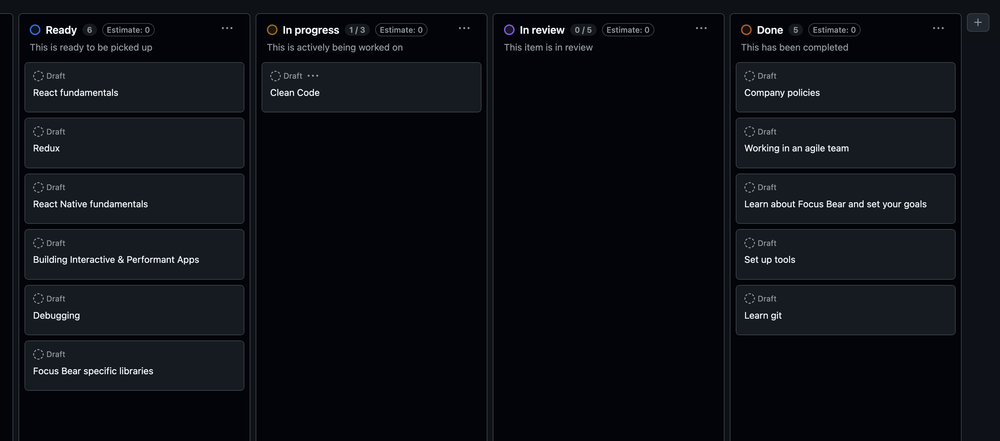

# Kanban Workflow

## Reflections

Kanban helps manage priorities by visualizing the entire workload and ensuring
transparency. Overload is avoided by limiting WIP (Work in Progress). Kanban
also allows breaking down big features into smaller tasks, making it easier to
track progress and reducing the overall workload.

Clear requirements and limited WIP can effectively improve my workflow.
Regularly updating tasks ensures transparency and keeps everyone aligned.

By regularly updating the Kanban board with the current status.
I can improve task tracking and maintain workflow efficiency.

Kanban Board: [GitHub Projects - Focus Bear](https://github.com/orgs/Focus-Bear/projects/5)

Created own Kanban board to make changes:-
My Kanban Board: [GitHub Projects - SaiCharan99](https://github.com/users/SaiCharan99/projects/2/views/1)

